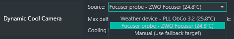

# Dynamic Cooling — N.I.N.A. Plugin

Dynamic camera cooling for [N.I.N.A.](https://nighttime-imaging.eu/) (Nighttime Imaging 'N' Astronomy). Instead of a fixed cooling setpoint, Dynamic Cooling picks the target temperature from a live ambient sensor (weather device, focuser probe, or a manual value), so your sequence cools to a sensible target every night — warm or cold — and never stalls because the TEC can't reach an over-ambitious setpoint.

It adds **one** Advanced Sequencer instruction — **Dynamic Cool Camera** — that is *context-aware*: drop it at the start of a night for a full cool-down, and/or in **After Each Target** to track the cooling night. It does the right thing in each spot automatically.

## Screenshot

Pick the temperature source from a dropdown that shows each connected device and its **live reading** — no cryptic numbers:



## The instruction

**Dynamic Cool Camera** lives under the **Dynamic Cooling** category in the Advanced Sequencer's instruction list. Place it wherever you want cooling managed:

- **Start of a night** (cooler off, or the sensor is still well above target) → it performs a full cool-down: reads ambient and targets `ambient − MaxDelta`, rounded to the nearest 5 °C step and clamped to a configurable minimum. If the TEC can't reach the target on a warm night, it automatically steps back to a sustainable setpoint (nearest 5 °C step above what the cooler actually achieved) so the sequence proceeds instead of hanging on cooling. **Manual** mode pins a fixed fallback target.
- **After Each Target** (cooler already on and cold) → it re-reads ambient and steps the camera colder as the night cools, snapping to 5 °C library steps. It skips when the TEC is already straining (> 90 % power), and with **Only step colder** on (default) it never steps *warmer* even if ambient rises.

| Setting | Default | Meaning |
|---------|---------|---------|
| Temperature Source | Weather device | Where to read ambient temperature. Choose from the dropdown — your **weather device**, the **focuser's temperature probe**, or **Manual** (use a fixed value). Each option shows the connected device and its current reading. |
| Max Delta | 35 °C | How far below ambient to target |
| Minimum Target | −20 °C | Coldest target allowed |
| Fallback Target | −10 °C | Used in Manual mode or when no sensor is available |
| Cooling Duration | 5 min | Cool-down timeout |
| Only step colder on re-check | on | When re-checked between targets, only ever step colder — never warm the camera back up mid-session |

## Why 5 °C steps?

Snapping targets to 5 °C steps keeps your light frames at temperatures that match a standard dark library (0, −5, −10, −15, −20 °C), so darks taken at those steps stay reusable.

## Installation

No compiling required — a prebuilt DLL is provided with every release.

**From inside N.I.N.A.** (once it's in the plugin catalogue — [manifest PR pending](https://github.com/isbeorn/nina.plugin.manifests/pull/480)): *Options → Plugins → Available*, find **Dynamic Cooling**, and click install.

**Manual install (works today):**
1. Download `NINA.Plugin.DynamicCooling.dll` from the [latest release](https://github.com/RegulusRemains/nina-dynamic-cooling/releases/latest).
2. Put it in `%LOCALAPPDATA%\NINA\Plugins\3.0.0\Dynamic Cooling\` (create the `Dynamic Cooling` folder if it doesn't exist).
3. Restart N.I.N.A.

## Building

Requires the .NET 8 SDK (with the Windows Desktop workload). Place the N.I.N.A. reference assemblies in a sibling `..\refs\` folder (copy them from your N.I.N.A. install directory), then:

```
dotnet build -c Release -p:Platform=x64
```

Output: `bin\x64\Release\NINA.Plugin.DynamicCooling.dll`.

## License

[MPL-2.0](LICENSE).
