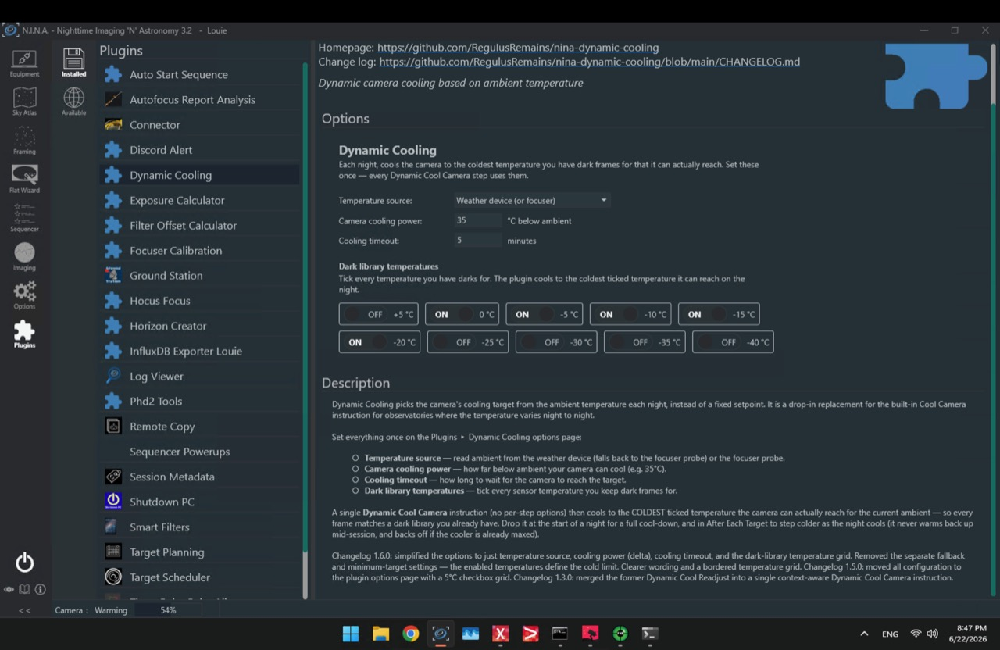

# Dynamic Cooling — N.I.N.A. Plugin

Dynamic camera cooling for [N.I.N.A.](https://nighttime-imaging.eu/) (Nighttime Imaging 'N' Astronomy). Instead of a fixed cooling setpoint, Dynamic Cooling derives the target from the ambient temperature each night and snaps it onto a temperature you actually keep dark frames for — so your lights always match a dark library, and the sequence never stalls because the TEC can't reach an over-ambitious setpoint.

It adds an Advanced Sequencer instruction — **Dynamic Cool Camera** — that is *context-aware*: drop it at the start of a night for a full cool-down, and/or in **After Each Target** to keep stepping colder as the night cools. It does the right thing in each spot automatically. It also adds a **Dew Heater Control** trigger that manages the camera's anti-dew heater based on how close the air is to the dew point. All configuration lives on the plugin's options page, so the sequencer items themselves need no setup.



## Setup — Plugins ▸ Dynamic Cooling

Open **Options → Plugins → Dynamic Cooling** and set these once (they apply to every *Dynamic Cool Camera* step, and are stored per profile):

| Setting | Default | Meaning |
|---------|---------|---------|
| **Temperature source** | Weather device | Where to read ambient temperature. *Weather device (or focuser)* uses the weather device and falls back to the focuser's probe if it's unavailable; *Focuser probe* uses the focuser only. |
| **Camera cooling power** | 35 °C | How far below ambient your camera's cooler can pull. ASI6200-class cameras manage about 35 °C. |
| **Cooling timeout** | 5 min | How long to wait for the camera to reach the target before the sequence continues. |
| **Dark library temperatures** | 0, −5, −10, −15, −20 °C | Tick every sensor temperature you keep dark frames for (a 5 °C grid from +5 down to −40 °C). The plugin only ever cools to one of these. |
| **Manage the dew heater** | On | Let the plugin switch the camera's anti-dew heater on/off automatically (requires the *Dew Heater Control* trigger in your sequence). |
| **Turn on within … °C of dew point** | 3 °C | How close the ambient air has to get to the dew point before the heater comes on. It switches off again once the air dries past this margin (plus a small hysteresis band). |

## How it works

**Dynamic Cool Camera** lives under the **Dynamic Cooling** category in the Advanced Sequencer's instruction list. Place it wherever you want cooling managed:

- **Start of a night** (cooler off, or the sensor is still well above target) → full cool-down. It reads ambient, computes `ambient − cooling power`, and snaps to the **coldest enabled dark-library temperature the camera can actually reach** (rounding toward warmer so the target is achievable). If the TEC still can't hold it on a warm night, it steps back to a sustainable enabled temperature so the sequence proceeds instead of hanging.
- **After Each Target** (cooler already on and cold) → it re-reads ambient and steps the camera **colder** as the night cools, moving between enabled temperatures only. It never warms the camera back up mid-session, and it backs off when the TEC is already straining (> 90 % power).

If no temperature reading is available at all, it falls back to the **warmest enabled** temperature (always reachable). If you enable *no* temperatures, it reverts to the legacy behavior of snapping to a uniform 5 °C grid.

## Dew heater control

Add the **Dew Heater Control** trigger (under the **Dynamic Cooling** category in the sequencer's *Triggers* list) anywhere in your sequence. Before each instruction it compares the ambient air temperature to the dew point:

- When the gap closes to within your margin (humid air → condensation risk on the camera's front window), it turns the camera's anti-dew heater **on**.
- Once the air dries out and the gap climbs back past the margin (plus a small hysteresis band so it doesn't flap), it turns the heater **off** again.

Dew control needs a **connected weather device** — that's where humidity / dew point comes from. The trigger uses the device's reported dew point, or computes it from temperature and humidity if the device doesn't provide one. If your camera has no dew heater, the trigger simply does nothing.

## Why dark-library temperatures?

Only cooling to temperatures you already have darks for keeps every light frame calibratable — no surprise setpoints, no rebuilding your dark library because a warm night forced an odd temperature. Tick the steps you maintain (commonly 0, −5, −10, −15, −20 °C) and the plugin always lands on one of them.

## Installation

No compiling required — a prebuilt DLL is provided with every release.

**From inside N.I.N.A.** (once it's in the plugin catalogue): *Options → Plugins → Available*, find **Dynamic Cooling**, and click install.

**Manual install (works today):**
1. Download `NINA.Plugin.DynamicCooling.dll` from the [latest release](https://github.com/RegulusRemains/nina-dynamic-cooling/releases/latest).
2. Put it in `%LOCALAPPDATA%\NINA\Plugins\3.0.0\Dynamic Cooling\` (create the `Dynamic Cooling` folder if it doesn't exist).
3. Restart N.I.N.A.

## Building

Requires the .NET 8 SDK (with the Windows Desktop workload). Place the N.I.N.A. reference assemblies in a sibling `..\refs\` folder (copy them from your N.I.N.A. install directory), then:

```
dotnet build -c Release -p:Platform=x64
```

Output: `bin\x64\Release\NINA.Plugin.DynamicCooling.dll`.

## License

[MPL-2.0](LICENSE).

## Tests

Unit tests for the sequencer logic live in `Tests/` (NUnit + Moq). They run against the
real NINA assemblies supplied in `..\refs` (the same set the plugin builds against), on a
Windows machine with the .NET 8 SDK:

```
dotnet test Tests
```
